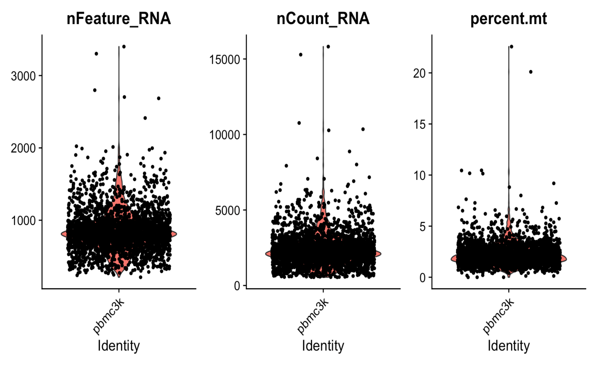
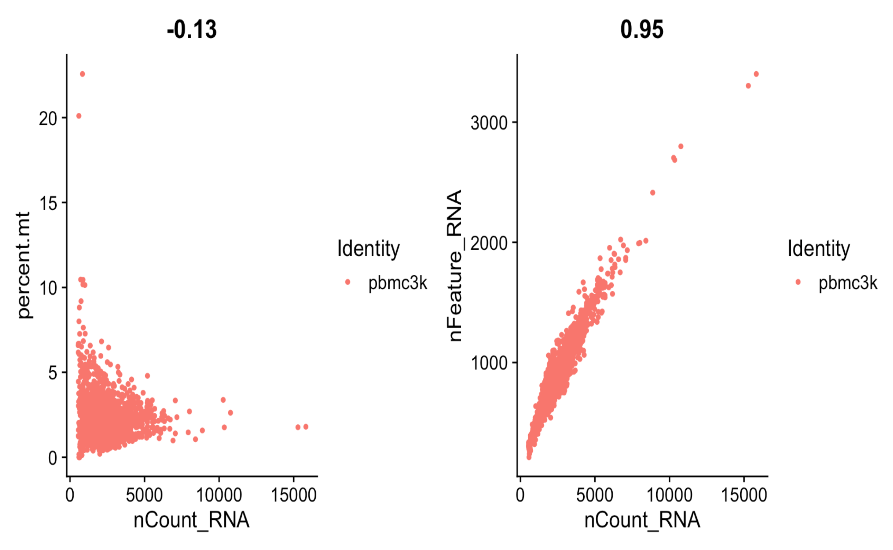
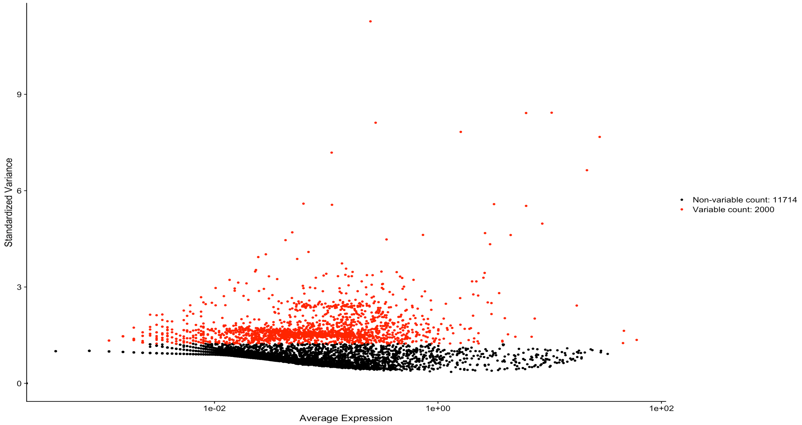
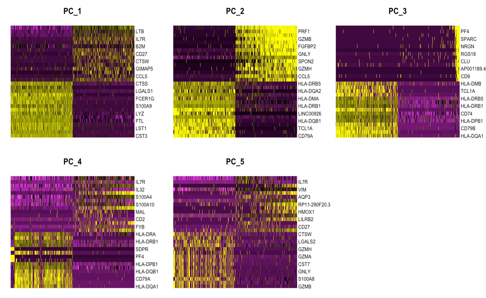
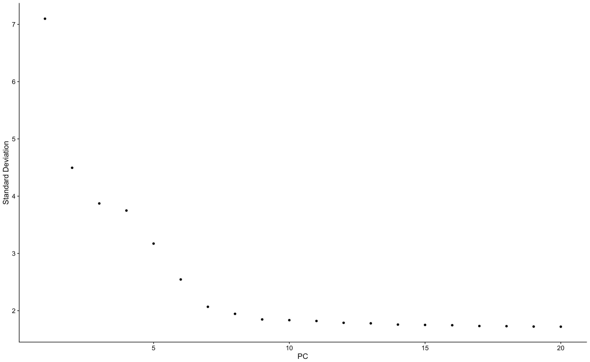
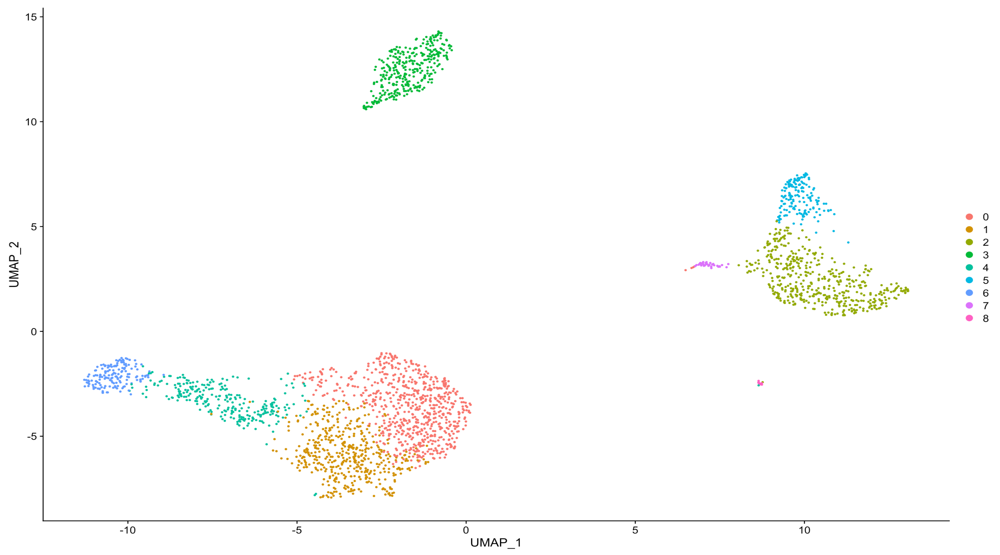
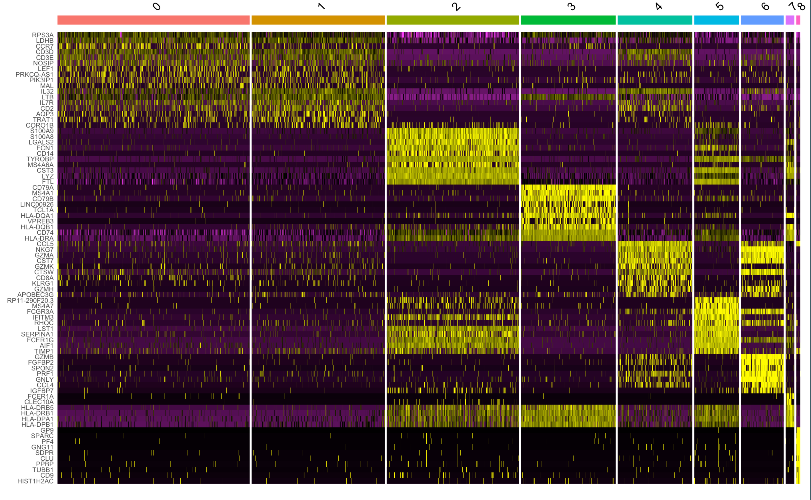

# Single Cell RNA Sequencing Data Analysis

This project re-analyzes the publicly available 10X Genomics Single Cell RNA Sequencing dataset, which can be found at https://support.10xgenomics.com/single-cell-gene-expression/datasets/1.1.0/pbmc3k. This project clusters single cells isolated from a healthy donor. This technique can be used to cluster cells for different experimental conditions and cohorts.      

Perpheral Blood Mononuclear Cells (PBMCs) were isolated from a healthy donor, library preparation was performed on the 10X Genomics platform, and sequencing was performed on the Illumina NextSeq 500 platform.

Having a look at the UMI counts, it seems that the number of features are mostly between 2000 and 200 and that 5% of the UMI counts map to the mitochondrial RNA. Low-quality cells or empty cells will often have few cells, whereas cell doublets or multiplets wil have high gene count. Also low-quality/ dying cells exhibit extensive mitochondrial contamination. Hence we will filter out the cells which have number of feature more than 2000 and less than 200, and also filter out the cells which UMI counts for mitochondrial genes more than 5%.

    

Looking at the Feature Scatter Plot, there doesn't seem to be any correlation between the total mRNA UMI counts and the total UMI mitochondrial frequency count. There is a positive correlation between the total mRNA UMI count and total feature mRNA UMI count.    

After filtering the dataset, I normalized the data using 'LogNormalize' method, where the feature expression measurements for each cell are normalized by the total expression and multipled by a scale factor of 10000.    

After normalization, I identified highly variable features by using the 'FindVariableFeatures' function. This function fits a polynomial regression between log(variance) and the log(mean) of the features. The observed mean and expected variance values given by the fitted line are standardized and variance is calculated on those standardized values. The top 2000 features are displayed below.     

Now that I have been able to find the most variable features, we go ahead to perform dimensional reduction to find as to find the differentially expression of the most variable features amongst the cells.    

Using Principal Component Analysis (PCA), displayed below are the differential expression of the genes for the first 5 PCs.  

Now that we have the PCs, we use the elbow method to determine which PCs to use for downstream analysis. The elbow plot below shows that the first 10 PCs give the maximum variance amongst the features.    

Now that we know which PCs to use, we use the UMAP reduction method to cluster the cells. Below is the UMAP generated which show 9 different clusters into which the cells are grouped into.   

The heatmap representing differentially expressed genes for all the 9 different clusters is shown below.

